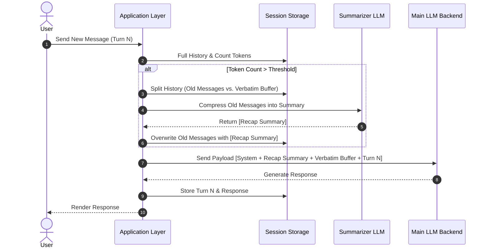

[[Context window]]: in-context memory
[[Recap]]: summary

Summarization processed by a [[Summarizer LLM]](common way), [[extraction pipeline]], or [[vector index]], The resulting high-level recap (e.g., "User is building a Python web app and previously installed Flask") replaces the original text.



[[Session storage]] is  backend
[[Application layer]] is frontend

## Old Messages (The Compression Zone)
- **Scope:** All historical turns from the beginning of the chat up to a designated boundary point (e.g., Turns 1 through $N - k$).
- **Role:** Serves as the "long-term memory" target.
- **Treatment:** These messages are removed from the active prompt payload and processed through a summarization model, extraction pipeline, or vector index. The resulting high-level recap (e.g., _"User is building a Python web app and previously installed Flask"_) replaces the original text.
- **Why it's split off:** Historical details like exact phrasing, minor clarifying questions, or intermediate code attempts lose relevance over time. Summarizing them drastically cuts token usage while preserving essential context.

## The Verbatim Buffer (The Preservation Zone)

- **Scope:** The $k$ most recent conversation turns leading up to the current prompt (e.g., the last 3 to 6 user/assistant message pairs).
- **Role:** Serves as the immediate "short-term memory."
- **Treatment:** These messages are passed directly into the prompt payload **unaltered**, maintaining exact formatting, syntax, and phrasing.
- **Why it's kept intact:** LLMs rely heavily on recent history for:
    - **Coreference resolution:** Understanding pronouns or ambiguous references (e.g., _"Fix the typo in that second function"_ requires knowing what "that second function" was).
    - **Code continuity:** Preserving exact code blocks so generated modifications match existing syntax.
    - **Instruction adherence:** Remembering immediate multi-step constraints or formatting instructions given in recent turns.

## How the Split Point Is Determined
The application layer uses dynamic rules to decide where "Old Messages" end and the "Verbatim Buffer" begins:
- **Token-Based Threshold:** The system retains the last 2,000 tokens verbatim. When total conversation history exceeds 8,000 tokens, everything older than the 2,000-token tail is sent to the summarizer.
- **Turn-Based Threshold:** The application enforces a rule to keep the last $N$ turns (e.g., last 4 turns) strictly verbatim, regardless of length, while lumping all earlier turns into the summarization pipeline.

## Visual Example of a Payload Reconstruction

```sh
[ FULL CONVERSATION HISTORY ] Turn 1: "Hi, I'm setting up a Postgres DB." 
Turn 2: "Here is my connection string..." ───┐ 
Turn 3: "How do I create a table?"           │ OLD MESSAGES 
Turn 4: "Here is the SQL snippet..."      ───┘ (Summarized into 1 block) -------------------------------------------------------------------------------- 
Turn 5: "Now write a Python script for it."     ───┐ VERBATIM BUFFER 
Turn 6: "Here is the Python script using psycopg2" │ (Kept exact token-for-token) Turn 7: "Change it to use asyncpg instead." 
                                                ───┘
```

## Final Prompt Sent to the LLM

```json
[
  {"role": "system", "content": "You are a database expert."},
  {"role": "system", "content": "[RECAP]: User is setting up PostgreSQL and previously created tables."},
  {"role": "user", "content": "Turn 5: Now write a Python script for it."},
  {"role": "assistant", "content": "Turn 6: Here is the Python script using psycopg2..."},
  {"role": "user", "content": "Turn 7: Change it to use asyncpg instead."}
]
```
