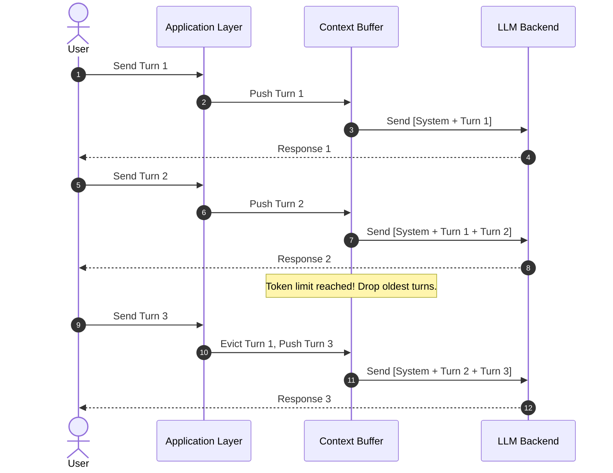

[[Context window]]

```mermaid
sequenceDiagram
    autonumber
    actor User
    participant App as Application Layer
    participant Window as Context Buffer
    participant LLM as LLM Backend

    User->>App: Send Turn 1
    App->>Window: Push Turn 1
    Window->>LLM: Send [System + Turn 1]
    LLM-->>User: Response 1

    User->>App: Send Turn 2
    App->>Window: Push Turn 2
    Window->>LLM: Send [System + Turn 1 + Turn 2]
    LLM-->>User: Response 2

    Note over Window: Token limit reached! Drop oldest turns.

    User->>App: Send Turn 3
    App->>Window: Evict Turn 1, Push Turn 3
    Window->>LLM: Send [System + Turn 2 + Turn 3]
    LLM-->>User: Response 3
```
