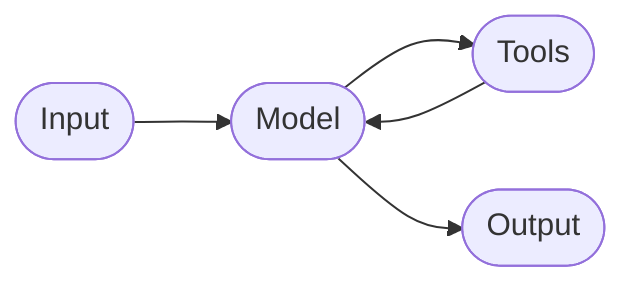

A system that can act.

Basic example: Components of an AI agent

```mermaid
flowchart LR
A([Input])
B([Model])
C([Tools])
D([Output])
A-->B
B-->C
C-->B
B-->D
```

> [!NOTE] About
> Model + Harness = AI Agent
> 
