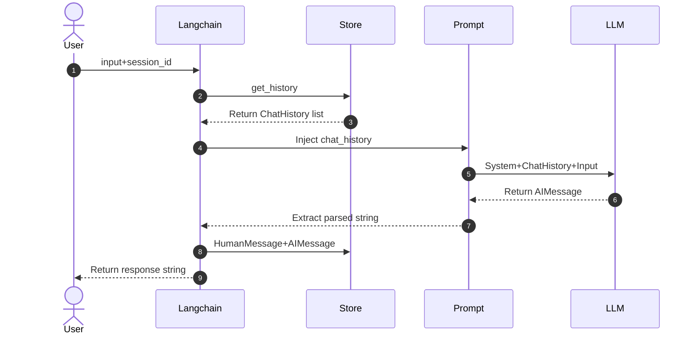

#memory 

Context windows are finite (e.g., 128k to 2M+ tokens). When conversations grow large, applications use several techniques to manage length without breaking continuity:
- **[[Turn]]**: Every interaction (message) to a model (API request)
- **[[Sliding Window]]:** The oldest user/assistant pairs are dropped while preserving the initial system instructions and recent conversation context.
- **[[Context Summarization]]:** A background worker model periodically summarizes older sections of the chat into a brief synopsis, inserting it into the system context.
- **[[RAG (Retrieval-Augmented Generation)]]:** Specific historical facts or chat passages are stored in a [[vector database]] and dynamically retrieved only when relevant to the user's current prompt.
- **[[Long-Term User Memory]]:** Features like persistent memory extract structured key-value facts (e.g., `"User name: Alex"`, `"Programming language: Python"`) and prepend them directly to the [[System prompt]] across different chat sessions.
## Langchain example of message history

```python
import os
from langchain_core.prompts import ChatPromptTemplate, MessagesPlaceholder
from langchain_core.runnables.history import RunnableWithMessageHistory
from langchain_core.output_parsers import StrOutputParser
from langchain_community.chat_message_histories import InMemoryChatMessageHistory
from langchain_openai import ChatOpenAI

# 1. Setup Prompt with MessagesPlaceholder for chat history
prompt = ChatPromptTemplate.from_messages(
    [
        ("system", "You are a technical AI assistant."),
        MessagesPlaceholder(variable_name="chat_history"),
        ("human", "{input}"),
    ]
)

# 2. Base LCEL Chain
llm = ChatOpenAI(model="gpt-4o-mini", temperature=0)
base_chain = prompt | llm | StrOutputParser()

# 3. Session Store Management (In-Memory for demo; swap for Redis/SQL in production)
session_store = {}


def get_session_history(session_id: str):
    if session_id not in session_store:
        session_store[session_id] = InMemoryChatMessageHistory()
    return session_store[session_id]


# 4. Wrap Chain with RunnableWithMessageHistory
chain_with_history = RunnableWithMessageHistory(
    base_chain,
    get_session_history,
    input_messages_key="input",
    history_messages_key="chat_history",
)

# 5. Multi-Turn Conversation
session_config = {"configurable": {"session_id": "user_session_001"}}

# --- Turn 1 ---
turn1_input = "Hi! I am building a RAG pipeline with PostgreSQL and pgvector."
response1 = chain_with_history.invoke({"input": turn1_input}, config=session_config)

print("--- Turn 1 ---")
print("User:", turn1_input)
print("AI:", response1)

# --- Turn 2 (Leveraging Memory) ---
turn2_input = "Which indexing strategy should I use for fast approximate nearest neighbor search?"
response2 = chain_with_history.invoke({"input": turn2_input}, config=session_config)

print("\n--- Turn 2 ---")
print("User:", turn2_input)
print("AI:", response2)
``` 

### Key Concepts
- **`MessagesPlaceholder`:** Injects the accumulated list of `BaseMessage` objects (`HumanMessage`, `AIMessage`) directly into the prompt payload at execution time.
- **`RunnableWithMessageHistory`:** An [[LCEL - LangChain Expression Language]] wrapper that automatically fetches conversation history before running the chain, injects it into `history_messages_key`, and appends the new input + model response back to the history store afterward.
- **`session_id` Isolation:** Passed inside `config={"configurable": {"session_id": "..."}}` to maintain separate history buffers for concurrent users or isolated chat threads.
- **Persistent Stores:** `InMemoryChatMessageHistory` can be replaced with production-ready backends like `PostgresChatMessageHistory` or `RedisChatMessageHistory` without changing the chain structure.
## Diagram


