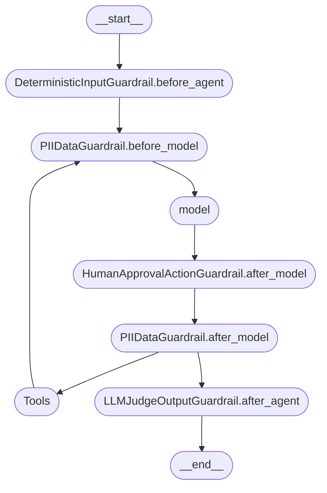

[[harness]]

Guardrails is a collection of static rules, best pratices to ensure that model response meet the product requirements.
- resilient
- prevent malicious atacks

Example of CREATE_AGENT from [[LangChain]]

#bestpratice
