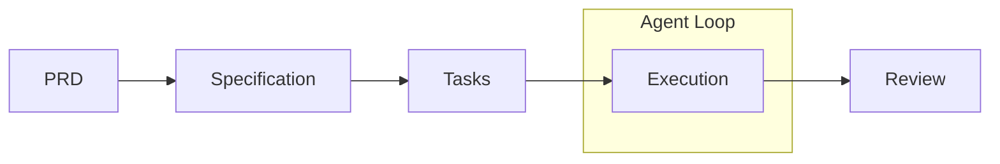

#sdd 

- Is a metodology where a specification is the primary artifact, and the  source code is the expression
- Inverse traditional flow: Instead of "code first, document later", is "specify first, code after"
- The specification works as contract between humans and IA (or between team members)
- Intent-driven: The intent é expressed in natural language, source code is "last-mile"

## Challenges

- Memory and self-learning
- 