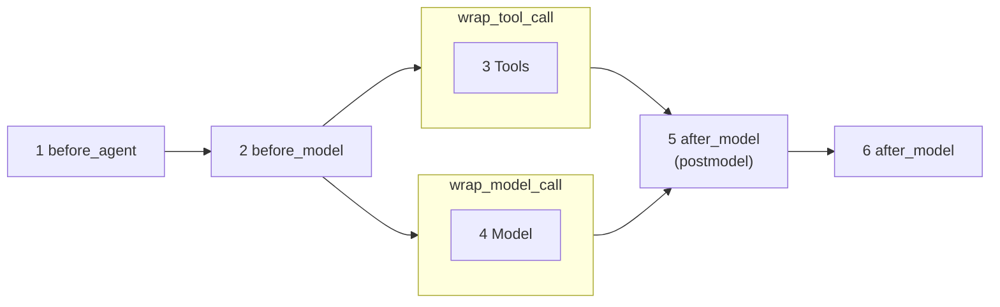

[[AI agent]]
from [[LangChain Inc]]




- Before message reach the model, do a validation.
- If the tool make search on the internet, It must be checked

Python example
```python
agent = create_agent(
	model = agent_model,
	tools = (publish_internal_notice),
	middleware = [
		# Layers
		DeterministicInputGuardrail(banned_keywords="lack", "exploit"),
		PIIDataGuardrail(),
		HumanApprovalActionGuardrail(
			interrupt_one(
				"publish_internal_notice": {"allowed_decisions": ["approve", "edit", "reject"]}
			)
		),
		LLMJudgeOutputGuardrail(),
	],
	state_schema=LayeredAuditState,
	checkpointer=InMemorySaver(),
	system_prompt=(
		"Responda de forma objetiva. Use a tool publish_internal_notice apenas quando o usuário pedir explicitamente para publicar"
	)
)
diplay(Image(agent.get_graph().draw_mermaid_png()))
```


> [!NOTE] [[MCP]] and [[Tools]]
> TIP: Langchain workflow can call tool directly, use [[MCP]] for standardaize and if the tool will be reused between systems.

Examples:
[[ExampleLangchainCreateAgent.ipynb]]
