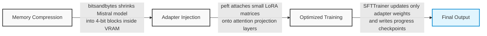

#ModelOptimization

Is a collection of techiniques to [[Fine-Tuning]] a LLM model, adjusting the ==weights== to a specific domain.



## Dataset for fine tunning

Formatting a custom dataset for LLM fine-tuning means converting your raw information into a structured file—such as a JSONL (JSON Lines) file—where each row contains clear fields for instructions, inputs, and expected responses.

### Example JSONL File Structure

```json
{"instruction": "Extract the invoice number from the text.", "input": "Invoice #10924 billed to Acme Corp.", "output": "10924"}
{"instruction": "Extract the invoice number from the text.", "input": "Receipt 45892 total paid $50.", "output": "45892"}
```

Golden Rules for Dataset Quality

- **Consistency:** Keep the phrasing of your instructions uniform across all examples.
- **Clarity:** Write accurate, high-quality answers. If the target output has typos or bad formatting, the model will copy those mistakes.
- **Size:** Start small. You only need **500 to 1,000 clean examples** to teach a model a new format or specific style effectively.
