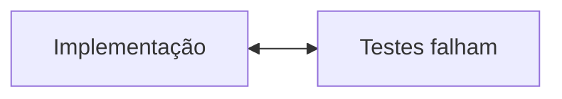

#ai 
The Ralph Wiggum Technique—the AI development methodology that reduces software costs to less than a fast food worker's wage.

https://github.com/ghuntley/how-to-ralph-wiggum
Referencia a [[Ralph Wiggum]] dos [[Simpsons]]. ignorancia + persistencia + otimismo

> DO NOT DO IT
```bash
while :; do cat PROMPT.md | claude-code ; done
```

## Passos para o Ralph loop:

- sem instalacão
- Persistencia via git + markdown 
- Executa com qualquer ferramenta que não limite tools calls.
- "Naive persistence": feedback não sanitizado.



- Stack trace completo (50+ linhas)
- Warnings do compilador
- Output do linter
- Mensagens de deprecation
- Erros de dependencia
- TUDO que o terminal cuspiu
