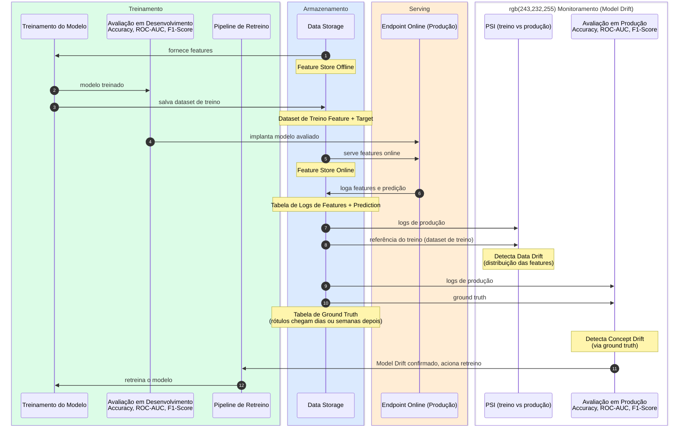

```mermaid
sequenceDiagram
    autonumber

    box rgb(220,252,231) Treinamento
        participant C as Treinamento do Modelo
        participant AD as Avaliação em Desenvolvimento<br/>Accuracy, ROC-AUC, F1-Score
        participant RT as Pipeline de Retreino
    end

    box rgb(219,234,254) Armazenamento
        participant DS as Data Storage
    end

    box rgb(255,237,213) Serving
        participant D as Endpoint Online (Produção)
    end

    box rgb(243,232,255) Monitoramento (Model Drift)
        participant S as PSI (treino vs produção)
        participant E as Avaliação em Produção<br/>Accuracy, ROC-AUC, F1-Score
    end

    DS->>C: fornece features
    Note over DS: Feature Store Offline
    C->>AD: modelo treinado
    C->>DS: salva dataset de treino
    Note over DS: Dataset de Treino Feature + Target
    AD->>D: implanta modelo avaliado
    DS->>D: serve features online
    Note over DS: Feature Store Online
    D->>DS: loga features e predição
    Note over DS: Tabela de Logs de Features + Prediction
    DS->>S: logs de produção
    DS->>S: referência do treino (dataset de treino)
    Note over S: Detecta Data Drift<br/>(distribuição das features)
    DS->>E: logs de produção
    DS->>E: ground truth
    Note over DS: Tabela de Ground Truth<br/>(rótulos chegam dias ou semanas depois)
    Note over E: Detecta Concept Drift<br/>(via ground truth)
    E->>RT: Model Drift confirmado, aciona retreino
    RT->>C: retreina o modelo
```
