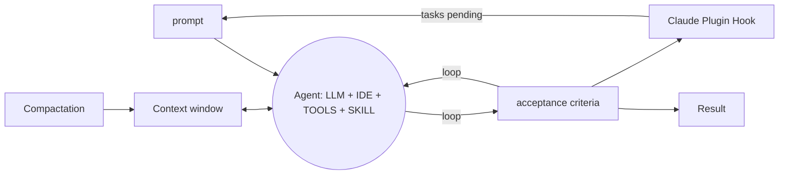

#development #generative_ai #spec-driven-development

Development strategy to create huge projects, that needs hours or day do be done. A standard method to create markdown documents to instruct the IA to complete each task.

IDE recomended to use: [[Claude Code]]



## [[Ralph Loop]]

### Step 1:
```bash
/ralph-loop "Migre de Jest para Vitest" --completion-promise "MIGRATED" --max-interactions 50
```
### Step 2
Plugin configura stop hook interno
### Step 3
Claude começa a trabalhar
### Step 4
Claude acha que terminou e tenta sair
### Step 5
> RALPH STOP HOOK

Check if text MIGRATED contains on result, on each interaction

- Every interation use the same prompt, so it needs to be well write to meet the objective.
- In the prompt, add a sentence to instruct the agent to write a log in a file PROGRESS.MD


See [[Spec Driven Development]]
