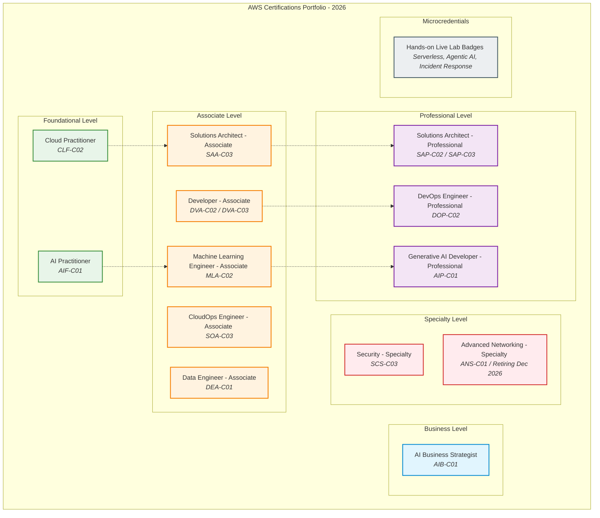

[[AWS cloud]]
[[AI Practitioner - AIP-C01]]

```mermaid
graph TD
    %% Styling
    classDef business fill:#e1f5fe,stroke:#0288d1,stroke-width:2px;
    classDef foundational fill:#e8f5e9,stroke:#388e3c,stroke-width:2px;
    classDef associate fill:#fff3e0,stroke:#f57c00,stroke-width:2px;
    classDef professional fill:#f3e5f5,stroke:#7b1fa2,stroke-width:2px;
    classDef specialty fill:#ffebee,stroke:#d32f2f,stroke-width:2px;
    classDef micro fill:#eceff1,stroke:#455a64,stroke-width:2px;

    subgraph AWS_2026 [AWS Certifications Portfolio - 2026]
        
        %% Business Level
        subgraph Business [Business Level]
            B1[AI Business Strategist <br><i>AIB-C01</i>]:::business
        end

        %% Foundational Level
        subgraph Foundational [Foundational Level]
            F1[Cloud Practitioner <br><i>CLF-C02</i>]:::foundational
            F2[AI Practitioner <br><i>AIF-C01</i>]:::foundational
        end

        %% Associate Level
        subgraph Associate [Associate Level]
            A1[Solutions Architect - Associate <br><i>SAA-C03</i>]:::associate
            A2[Developer - Associate <br><i>DVA-C02 / DVA-C03</i>]:::associate
            A3[CloudOps Engineer - Associate <br><i>SOA-C03</i>]:::associate
            A4[Data Engineer - Associate <br><i>DEA-C01</i>]:::associate
            A5[Machine Learning Engineer - Associate <br><i>MLA-C02</i>]:::associate
        end

        %% Professional Level
        subgraph Professional [Professional Level]
            P1[Solutions Architect - Professional <br><i>SAP-C02 / SAP-C03</i>]:::professional
            P2[DevOps Engineer - Professional <br><i>DOP-C02</i>]:::professional
            P3[Generative AI Developer - Professional <br><i>AIP-C01</i>]:::professional
        end

        %% Specialty Level
        subgraph Specialty [Specialty Level]
            S1[Security - Specialty <br><i>SCS-C03</i>]:::specialty
            S2[Advanced Networking - Specialty <br><i>ANS-C01 / Retiring Dec 2026</i>]:::specialty
        end

        %% Microcredentials
        subgraph Micro [Microcredentials]
            M1[Hands-on Live Lab Badges <br><i>Serverless, Agentic AI, Incident Response</i>]:::micro
        end

    end

    %% Suggested Progression Vectors (Optional visual layout helpers)
    F1 -.-> A1
    F2 -.-> A5
    A1 -.-> P1
    A2 -.-> P2
    A5 -.-> P3
```
