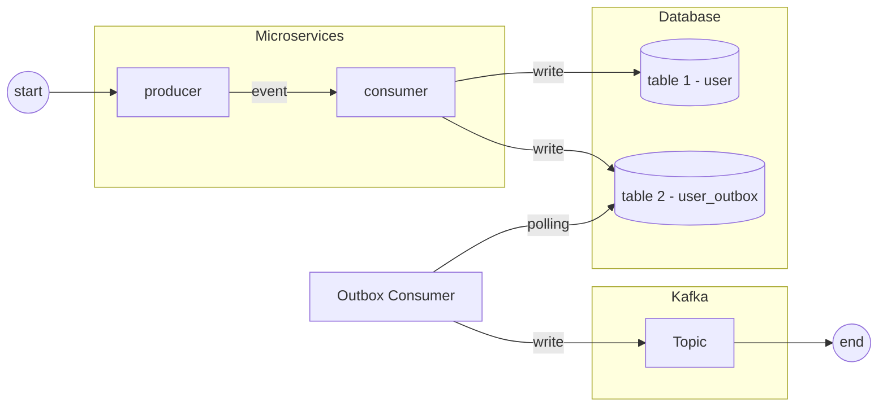

[[Design patterns]]

**Problem**:

**Solution**: In event-driven systems, to ensure that events will be processed, needs to write the message in a table (on the database), then, other process will consume

