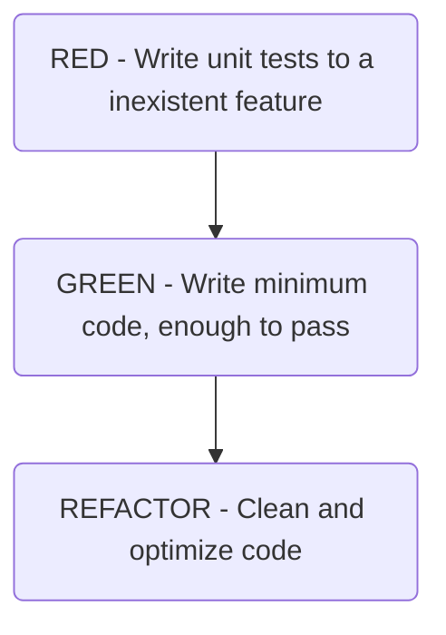

#software #architecture
# Test-Driven Development

Red-Green-Refactor

```mermaid
flowchart TD
Red(RED - Write unit tests to a inexistent feature)
Green(GREEN - Write minimum code, enough to pass)
Refactor(REFACTOR - Clean and optimize code)
Red-->Green-->Refactor
```
